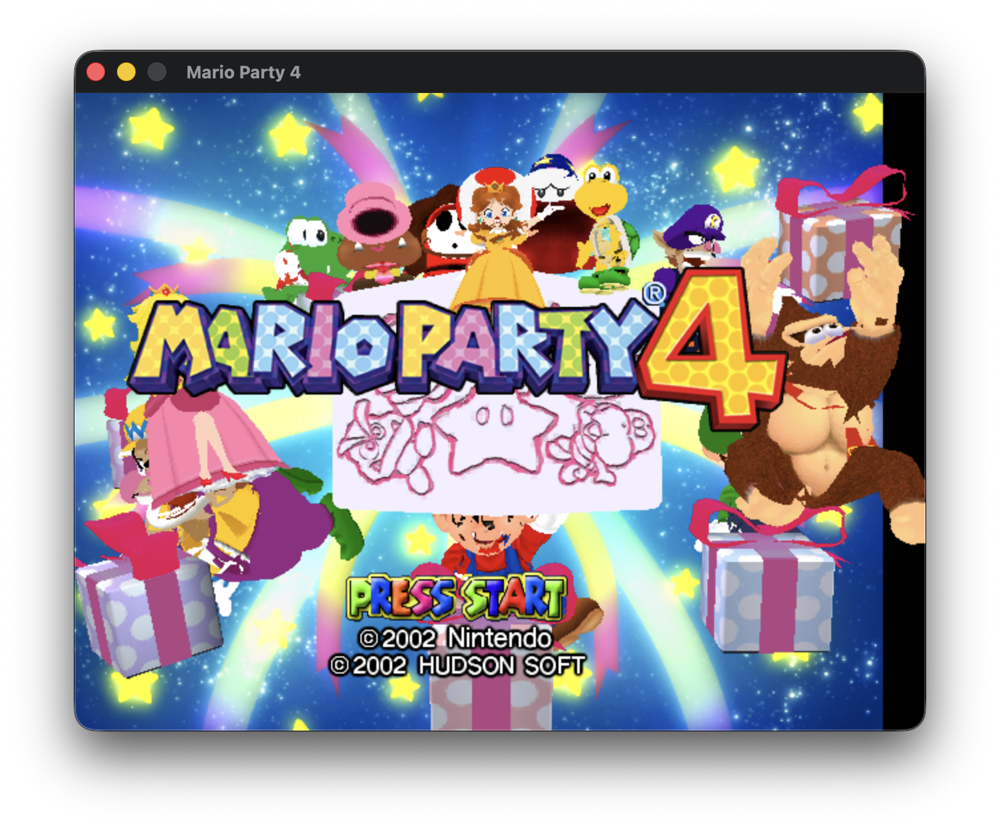

# Mario Party 4 Recompilation

Based on https://github.com/mariopartyrd/marioparty4

Disclaimer, I ran Claude on this project for a few hours and got the game into a bootable state. It's not playable but it does display basic graphics and can progress to the save screen by pressing Enter.

This has only been tested on MacOS using an M series chip, it might not boot on other platforms.



<p align="center" width="100%">
<video src="https://github.com/user-attachments/assets/d72df47c-72d5-464a-b1ea-959c9a986539" width="80%" controls></video>
</p>

## Setup

### Prerequisites

- CMake
- A C compiler (clang/gcc)
- SDL2 (`brew install sdl2` on macOS)
- Python 3 with `pyisotools` (`pip install pyisotools`)
- A legally obtained Mario Party 4 (USA) (Rev 0) GameCube ISO

### Extract game files

The PC port reads game data from `orig/GMPE01_00/files/`. You need to extract your ISO into this directory structure.

**Option A: Using the included script**

```sh
uv run tools/build_iso.py
```

Follow the prompts to select and extract your ISO.

**Option B: Manual extraction with pyisotools**

```python
from pyisotools import GamecubeISO
GamecubeISO.from_iso("path/to/mario_party_4.iso").extract("orig/GMPE01_00")
```

**Option C: Using Dolphin Emulator**

Right-click the game in Dolphin > Properties > Filesystem > right-click root > Extract Entire Disc. Place the extracted `files/` directory into `orig/GMPE01_00/`.

After extraction, the structure should look like:

```
orig/GMPE01_00/
  files/
    data/       # Game data (.bin files)
    dll/        # REL modules (.rel files)
    mess/       # Message/text files
    movie/      # Video files
    sound/      # Audio files
```

> Extracted game files are gitignored and must not be committed.

### Build and run

```sh
mkdir -p build_pc && cd build_pc
cmake .. -DTARGET_PC=ON
cd ..
./start.sh
```

`./start.sh` will build and launch the game. It must be run from the project root so it can find data at `orig/GMPE01_00/files/`.
